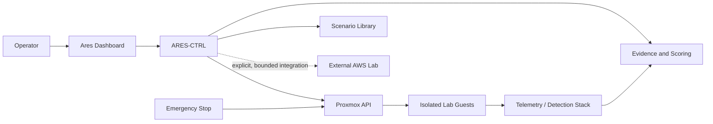

# Project Ares v1

> A headless, Proxmox-based cyber range for controlled adversary simulation and detection validation.

Ares v1 repurposes an existing Windows 10-era desktop largely as-is. The first milestone is a useful, repeatable lab—not a hardware rebuild. The platform orchestrates isolated attack scenarios, restores known-good snapshots, measures defensive visibility, and produces after-action evidence.

## Mission

Ares is the adversary-simulation and detection-validation component of the broader COC environment. It helps answer three questions:

1. Did the control detect the behavior?
2. Did the response workflow work?
3. Can the exercise be repeated safely and measured consistently?

## Scope

**Ares v1:** Prove the platform on the existing PC, using Proxmox VE, isolated virtual networks, lean guest sizing, scenario automation, detection scoring, and repeatable reset workflows.

**Ares v2:** Migrate the proven platform to a purpose-built server chassis and refresh hardware where justified by measured v1 constraints.

## Planned lab

| Guest | Role | Initial sizing target |
|---|---|---:|
| AD-DC-01 | Active Directory domain controller and DNS | 2 vCPU / 2 GB |
| WIN-01 | Windows workstation | 2 vCPU / 2–3 GB |
| WIN-02 | Secondary Windows workstation | 2 vCPU / 2–3 GB |
| ATTACK-01 | Kali operator host | 2 vCPU / 2 GB |
| WEB-01 | Linux host with intentionally vulnerable web apps | 2 vCPU / 2 GB |
| LINUX-01 | General Linux endpoint/server | 1–2 vCPU / 1–2 GB |
| ARES-CTRL | Scenario orchestration, dashboard, evidence | 2 vCPU / 2 GB |

The 16 GB starting configuration cannot comfortably run every guest at once. Scenarios use guest subsets, conservative reservations, and shut down idle systems. The planned 32 GB upgrade removes much of this constraint.

## Capabilities roadmap

- One-click scenario launch, reset, and emergency stop
- Snapshot-driven restoration to known-good state
- Safe simulations for phishing, credential access, Kerberoasting, lateral movement, insider threat, web attacks, Linux compromise, cloud-account compromise, ransomware-like behavior, and full attack chains
- Detection scoring mapped to expected telemetry and alerts
- Mission history and after-action reports
- External AWS lab integration with separate credentials and explicit teardown

## Architecture



See [Architecture](docs/architecture.md), [network and security design](docs/network-security.md), and [automation design](docs/automation.md).

## Repository map

```text
docs/                 Architecture, hardware, inventory, design, safety, roadmap
scenarios/            Scenario specifications and future executable definitions
runbooks/             Operator and emergency procedures
playbooks/            Defensive validation playbooks
reports/              Sanitized after-action templates and mission history schema
automation/           Future orchestration code and configuration
dashboard/            Future dashboard implementation
```

## Delivery phases

1. Inventory and back up the old PC; verify AMD-V/IOMMU and storage health.
2. Install Proxmox VE and configure isolated management and lab networks.
3. Build templates and deploy a minimal guest subset.
4. Establish snapshots, reset verification, telemetry, and emergency stop.
5. Implement scenarios one at a time, beginning with a benign validation mission.
6. Add scoring, mission history, reports, and dashboard workflows.
7. Measure bottlenecks before approving v1 upgrades or designing v2.

## Safety statement

This project is for systems the operator owns or is explicitly authorized to test. Intentionally vulnerable guests and adversary tooling remain on isolated lab networks. Scenarios default to simulation, use synthetic data and test accounts, and must include preflight, abort, cleanup, and verification steps. See [SECURITY.md](SECURITY.md).

## Status

Design and repository foundation. Implementation artifacts are intentionally tracked as milestones rather than represented as complete.

## License

Documentation and original code are released under the [MIT License](LICENSE). Third-party tools, operating systems, and vulnerable applications retain their own licenses.
